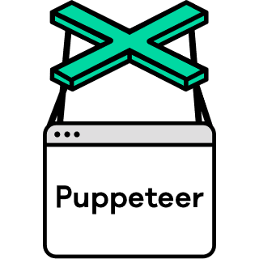

<!DOCTYPE HTML>
<html lang="en">

<p>
  
  <a href="https://opensource.org/licenses/ISC" target="_blank">
    
  </a>
</p>
</html>

## Description
> #### This is a service to controls headless browser by json requests
> This project, which is in continues development, allows you to control and manage most of the important features
> of a headless browser through a server
> that receive requests in json and are translated it to Puppeteer actions.

## Preparing the environment

#### Docker
>Download docker desktop [here](https://www.docker.com/products/docker-desktop/) and install it.

#### MongoDb
>Download mongodb [here](https://www.mongodb.com/try/download/community-kubernetes-operator) and install it.

```sh
  docker run -d --name YOUR_CONTAINER_NAME -p 27017:27017 -e MONGO_INITDB_ROOT_USERNAME=YOUR_USERNAME -e MONGO_INITDB_ROOT_PASSWORD=YOUR_PASSWORD -v C:/mongodb/cloud_scrapy/mongo:/data/db mongo:5.0.6```
```

#### DragonFlyDB (Replace for redis)
>Download DragonFlyDB [here](https://www.dragonflydb.io/docs/getting-started) and install it.

```sh
docker run -d --name YOUR_CONTAINER_NAME -p 6379:6379 --ulimit memlock=-1 -v C:/dragonfly/cloud_scrapy/db:/data docker.dragonflydb.io/dragonflydb/dragonfly
```


#### Configuring environment 
Only need to set variable NODE_ENV in (dev, pre, pre) all the names of the config files
in the ./config directory
~~~
NODE_ENV=dev

NODE_ENV=pre

NODE_ENV=pre

NODE_ENV=YOUR_FILE_NAME
~~~


#### Install dependencies

```sh
npm install
```

#### Run in dev mode

```sh
npm run dev
```

#### Run in normal mode.

```sh
npm run start
```

#### Run tests

```sh
npm run tests
```

#### Autogenerate API-DOCS

```sh
npm run swagger
```


## How to use it
A full request execution json is divided by 4 jsons:
* request_description (An small description of the request for easy understand later) Example:
~~~
"request_description": YOUR_DESCRIPTION
~~~
* send_in_request (It is what you send to the server to perform actions) Example:
* [See documentation for every instruction below](https://pptr.dev/)
~~~
"send_in_request": {
    "url": "YOUR_URL", "options": {},
    "instructions": [
        {command: "goto", params: ["YOUR_URL"], options: {}},
        {command: "click", params: ["SELECTOR"], options: {}},
        {command: "click_and_wait", params: ["SELECTOR"], options: {}},
        {command: "wait_for_selector", params: ["SELECTOR"], options: {}},
        {command: "wait_for_selector_and_click", params: ["SELECTOR"], options: {}},
        {command: "wait_selector_click_wait_nav", params: ["SELECTOR"], options: {}},
        {command: "wait_for_xpath", params: ["XPATH"], options: {}},
        {command: "wait_for_function", params: ["JAVASCRIPT_FUNCTION"], options: {}},
        {command: "wait_for_navigation", params: [], options: {}},
        {command: "evaluate", params: ["JAVASCRIPT_CODE"], options: {}},
        {command: "verify", params: ["TEXT"], options: {}}, //Verify if a text exist in the current page and return true or false that leads to action required or not
        {command: "xpath", params: ["XPATH"], options: {}},
        {command: "type", params: ["SELECTOR", "TEXT"], options: {}},
        {command: "sec_type", params: ["SELECTOR", "ENCRYPTED_TEXT"], options: {}},
        {command: "keyboard_press", params: ["KEY_INPUT"], options: {}},
        {command: "keyboard_down", params: ["KEY_INPUT"], options: {}},
        {command: "keyboard_up", params: ["KEY_INPUT"], options: {}}
    ]
}
~~~
* get_in_response (It is what you need the server to send you once the execution is finished) Example:
~~~ 
"get_in_response": {
    cookies: true,
    headers: true,
    html_to_pdf: true,
    logs: {
        active: true,
        full_logs: false
    },
    screenshot: {
        active: true,
        full_page: false
    },
    source_page: true,
    extract_rules: [
        {"name": YOUR_RULE_NAME, "selector": SELECTOR, "attribute": "THE_ATTR_YOU_WANT")
    ]
}
~~~
* request_config (It is the way in which you configure your request according to your use case.) Example:

* Resources: 
document, stylesheet, image, media, font, script, texttrack,
xhr, fetch, eventsource, websocket, manifest, other
~~~
"request_config": {
    block_resources: [RESOURCES],
    headers: "YOUR_HEADERS",
    cookies: "YOUR_COOKIES",
    captcha: true,
    geolocation: {latitude: "LATITUDE", longitude: "LONGITUDE"},
    user_agent: "YOUR_USER_AGENT/OR_CLOUDSCRAPY ASSIGNS RANDOM ONE",
    view_port: {width: "WIDTH", height: "HEIGHT"},
    custom_proxy: "YOUR_URI_CUSTOM_PROXY"
}
~~~

* An ActionRequiredExecution is similar than an execution, this endpoint is call it when 
an execution need to solve some action after verify that something planed happened in the html and take some actions instead

~~~
{
    context_id: "YOUR_CONTEXT_ID_FROM_PREVIOUS_EXECUTION",
    request_id: "YOUR_REQUEST_ID_FROM_PREVIOUS_EXECUTION",
    request_description: "YOUR_DESCRIPTION",
    send_in_request: {THE SAME THAT EXECUTION}
}
~~~

## Directory Tree
    
    cloud-scrapy
    ├── bin
    ├── components
    ├── config
    │       └── config_files
    │       └── docs
    ├── config_deploy
    │       └── pre
    │       └── pro
    ├── controllers
    ├── files
    │       └── logs
    │       └── pdfs
    │       └── screenshots
    ├── middlewares
    ├── models
    ├── objects
    ├── public
    │       └── images
    ├── routes
    │   └── v1
    ├── tests
    └── utils

## Documentation
- Api-Docs endpoint => http://localhost:3000/api-docs

## Author

👤 **Jose E Cortes**

* Website: https://cortestudios-portfolio.netlify.app/
* Twitter: [@Joshecm94](https://twitter.com/Joshecm94)
* Github: [@jecortes2304](https://github.com/jecortes2304)
* LinkedIn: [@josé-ernesto-cortes-mendez-7bb8671b6](https://linkedin.com/in/josé-ernesto-cortes-mendez-7bb8671b6)

## 📝 License

This project is [ISC](https://opensource.org/licenses/ISC) licensed.

## Show your support

Give a ⭐ if this project helped you!


<div align="center">
	<code></code>
	<code></code>
	<code></code>
	<code></code>
	<code></code>
</div>

<div align="center">
<h5> This software utilizes the <a href="https://github.com/puppeteer/puppeteer">Puppeteer</a> library to run the core instructions and navigate with the headless browser .</h5>
</div>


<div align="center">Powered by <b>Puppeteer 🚀</b></div>

<p align="center">
    
</p>

